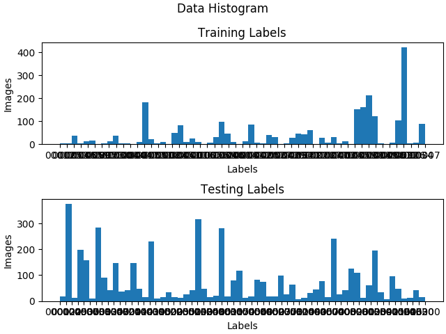
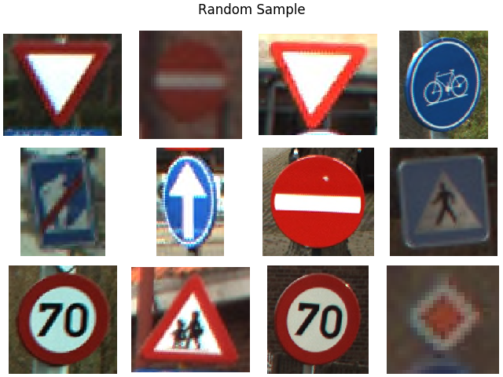

# Belgium
Implementation of TensorFlow in Python.
This system is intended to analyze Belgium traffic data.

## References
- [TensorFlow Installation](https://www.tensorflow.org/install/pip)
- [TensorFlow Tutorial](https://www.datacamp.com/community/tutorials/tensorflow-tutorial)
- [TensorFlow vs NumPy](https://www.quora.com/What-is-the-difference-between-Numpy-and-TensorFlow)
- [Tutorials for TensorFlow](https://www.guru99.com/tensorflow-tutorial.html)
- [Scikit Image](https://scikit-image.org/)
- [Python3 LRU Cache](https://docs.python.org/dev/library/functools.html#functools.lru_cache)
- [Matplotlib](https://matplotlib.org/3.1.1/gallery/subplots_axes_and_figures/figure_title.html)
- [OpenCV2](https://pypi.org/project/opencv-python/)

## Why TensorFlow?
```
Numpy has N-d array support but does not have methods to create tensor functions, can’t automatically compute derivatives and it can’t take advantage of GPU.

TensorFlow provides primitives for defining functions on tensors and automatically computing their derivatives. TensorFlow computations define a graph that has no numerical value until evaluated.
```

## Data Visualization



## Usage
Install the virtual environment.
```bash
virtualenv -p python3 .env
source .env/bin/activate
```
First, download the datasets from [here](http://btsd.ethz.ch/shareddata/)
Then, txecute the AI script:
```bash
clear; python3 think.py
```
